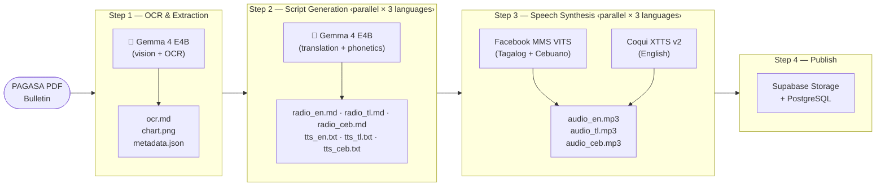
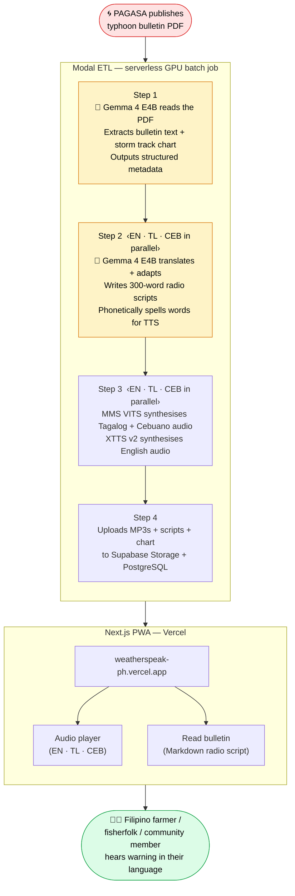

# WeatherSpeak PH

AI-powered multilingual severe weather communications for the Philippines.  
**Gemma 4 Good Hackathon — deadline May 18, 2026.**

---

## The Problem

PAGASA issues typhoon bulletins in English only. Most Filipinos most at risk — farmers, fisherfolk, rural communities — speak Tagalog or Cebuano (Bisaya), not English. When a typhoon is approaching, they may not understand the warning in time to act.

## What It Does

WeatherSpeak PH ingests PAGASA PDF bulletins, translates them into Tagalog and Cebuano, and generates MP3 audio so communities can *hear* the warning in their own language — on any phone, with no reading required.

---

## Architecture

### ETL Pipeline

Batch ETL runs on **Modal** (serverless GPU). Steps 2 and 3 each spin up one container per language and run all three concurrently.



### End-to-End Flow

Shows the full journey from PAGASA publishing a bulletin to a community member hearing it in their language, and where Gemma 4 is used.



> 🤖 **Gemma 4 E4B** is used in Steps 1 and 2 — it reads the raw English PDF, understands the storm track chart, and produces natural-sounding Tagalog and Cebuano radio scripts with correct phonetic spellings for the TTS synthesisers.

---

## Stack

| Layer | Technology |
|---|---|
| OCR + translation | Gemma 4 E4B via Ollama (`gemma4:e4b`) |
| TTS — Cebuano / Tagalog | Facebook MMS VITS (`facebook/mms-tts-ceb`, `facebook/mms-tts-tgl`) |
| TTS — English | Coqui XTTS v2 (`tts_models/multilingual/multi-dataset/xtts_v2`) |
| GPU compute | Modal (serverless A10G) |
| Frontend | Next.js / Vercel (PWA, mobile-first, CEB/TL/EN i18n) |
| Storage | Supabase Storage + PostgreSQL |
| Package manager | uv |
| Python | 3.12+ |

---

## Languages

| Language | Code | TTS model |
|---|---|---|
| English | `en` | Coqui XTTS v2 (Damien Black voice) |
| Tagalog | `tl` | Facebook MMS VITS (`mms-tts-tgl`) |
| Cebuano | `ceb` | Facebook MMS VITS (`mms-tts-ceb`) |

---

## Running the ETL

```bash
# First time — initialise Modal volumes:
uv run modal run modal_etl/setup_volumes.py::setup_ollama_volume
uv run modal run modal_etl/setup_volumes.py::setup_tts_volume

# Process the 3 most recent bulletins:
uv run modal run modal_etl/run_batch.py --n 3

# Force re-run all steps even if outputs exist:
uv run modal run modal_etl/run_batch.py --n 1 --force

# Use --detach when processing many bulletins — submits the job to Modal and
# returns immediately so your local terminal doesn't time out waiting for logs.
# The ETL continues running on Modal's infrastructure in the background.
uv run modal run --detach modal_etl/run_batch.py --n 5

# Force re-run all steps across multiple bulletins without risking a local timeout:
uv run modal run --detach modal_etl/run_batch.py --n 5 --force
```

ETL run reports are saved to `data/etl_reports/etl_report_{timestamp}.md`.

---

## Project Structure

```
modal_etl/           # ETL pipeline (Modal functions)
  run_batch.py       # Batch entrypoint — orchestrates all 4 steps
  step1_ocr.py       # Gemma 4 OCR + chart extraction
  step2_scripts.py   # Radio script + TTS text generation (3 languages in parallel)
  step3_tts.py       # Speech synthesis (3 languages in parallel)
  step4_upload.py    # Supabase upload + DB upsert
  phonetics.py       # Deterministic phonetic post-processing for TL/CEB TTS
  synthesizers/      # MMSSynthesizer, CoquiXTTSSynthesizer

web/                 # Next.js PWA frontend
  app/               # App Router pages
  components/        # React components
  lib/               # Shared utilities + i18n

notebooks/           # Numbered Jupyter notebooks — primary dev artifacts
  04-gemma4.ipynb    # OCR + structured JSON extraction
  06-radio-bulletin.ipynb  # Radio script generation
  08-mms-tts-experiment.ipynb  # TTS synthesis experiments

data/
  radio_bulletins/   # Generated scripts and TTS text files (local cache)
  etl_reports/       # ETL run reports (generated at runtime, gitignored)

tests/               # Python test suite
docs/superpowers/    # Design specs and implementation plans
```

---

## Hackathon Tracks

- **Impact — Digital Equity & Inclusivity**
- **Impact — Global Resilience**
- **Special Technology — Ollama**
- **Main Track**

---

## Development Log

See [`devlog.md`](devlog.md) for a full record of progress by PR.
