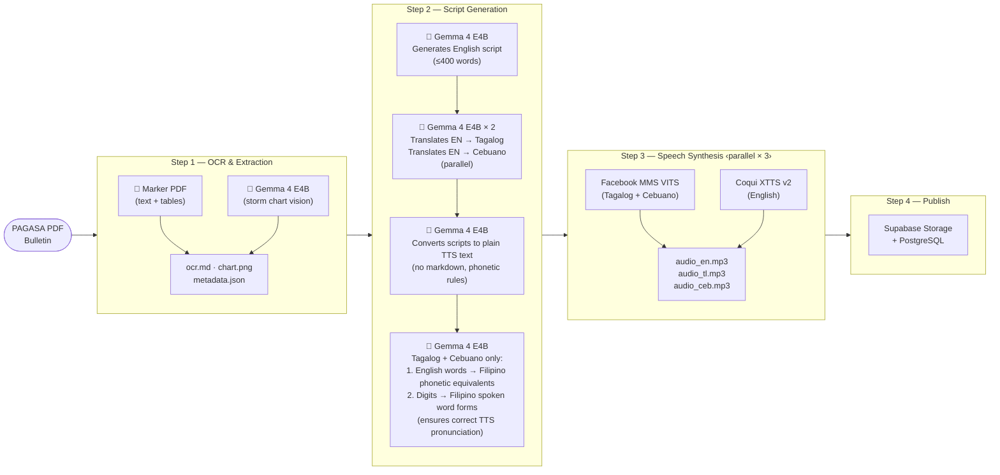
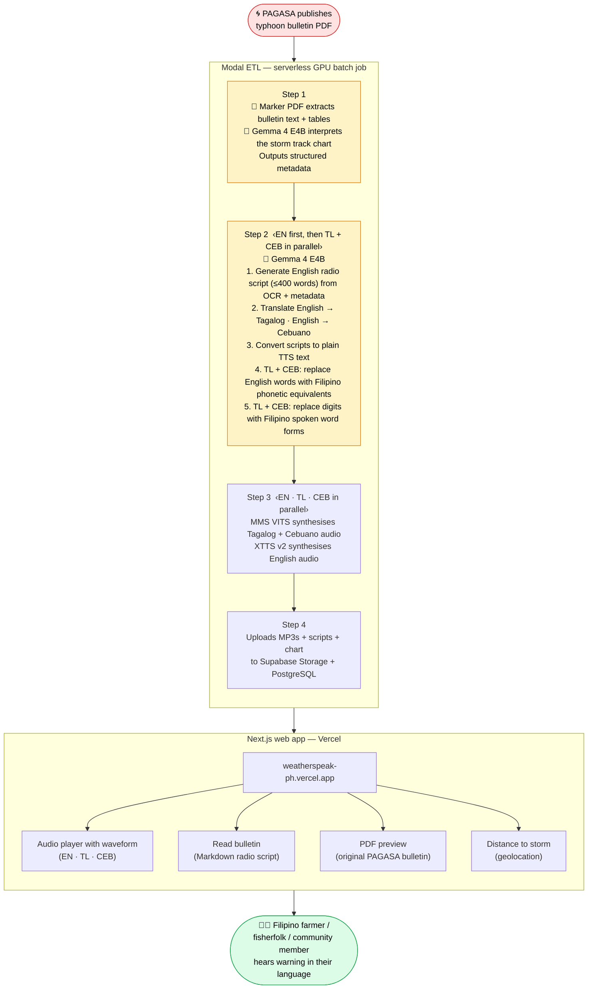

# WeatherSpeak PH

AI-powered multilingual severe weather communications for the Philippines.  
**Gemma 4 Good Hackathon — deadline May 18, 2026.**

---

## The Problem

PAGASA issues typhoon bulletins in English only. Most Filipinos most at risk — farmers, fisherfolk, rural communities — speak Tagalog or Cebuano (Bisaya), not English. When a typhoon is approaching, they may not understand the warning in time to act.

**But the language barrier is only half the problem.**

Even a Tagalog or Cebuano translation in text form leaves millions behind. According to the Philippine Statistics Authority's 2019 Functional Literacy, Education and Mass Media Survey (FLEMMS), roughly **8–9 million Filipinos aged 10–64 are functionally illiterate** — meaning they cannot read with sufficient comprehension to act on written instructions. In rural and coastal communities hardest hit by typhoons, that share is even higher.

A bulletin on a screen — in any language — cannot reach someone who cannot read it.

## What It Does

WeatherSpeak PH ingests PAGASA PDF bulletins, translates them into Tagalog and Cebuano, and generates MP3 audio so communities can *hear* the warning in their own language — on any phone, with no reading required.

> **Audio is the equaliser.** It crosses the language barrier *and* the literacy barrier in one step. A farmer in Leyte with a basic mobile phone and no schooling can press play and understand exactly what is coming and what to do.

---

## Architecture

### ETL Pipeline

Batch ETL runs on **Modal** (serverless GPU). Step 2 runs English first, then Tagalog and Cebuano in parallel (each translates from the English output). Step 3 synthesises all three languages in parallel.



### End-to-End Flow

Shows the full journey from PAGASA publishing a bulletin to a community member hearing it in their language, and where Gemma 4 is used.



> 🤖 **Gemma 4 E4B** is used in Steps 1 and 2. In Step 1 it reads the raw PDF pages with vision, extracts all narrative bulletin fields, and describes the storm track chart. In Step 2 it generates a plain English radio script from the extracted data, then translates that script into Tagalog and Cebuano — ensuring both translations are grounded in the same verified English text.

---

## Stack

| Layer | Technology |
|---|---|
| OCR backend (default) | Marker PDF (Surya layout-aware extractor) + Gemma 4 chart description |
| OCR backend (alternative) | Gemma 4 E4B vision via Ollama (`gemma4:e4b`) — `--backend gemma4` |
| Script generation | Gemma 4 E4B via Ollama (`gemma4:e4b`) |
| TTS — Cebuano / Tagalog | Facebook MMS VITS (`facebook/mms-tts-ceb`, `facebook/mms-tts-tgl`) |
| TTS — English | Coqui XTTS v2 (`tts_models/multilingual/multi-dataset/xtts_v2`) |
| GPU compute | Modal (serverless A10G) |
| Frontend | Next.js 14 / Vercel (PWA, mobile-first, CEB/TL/EN i18n) |
| Storage | Supabase Storage + PostgreSQL |
| Package manager | uv |
| Python | 3.12+ |

---

## Languages

| Language | Code | TTS model |
|---|---|---|
| English | `en` | Coqui XTTS v2 (Damien Black voice) |
| Tagalog | `tl` | Facebook MMS VITS (`mms-tts-tgl`) |
| Cebuano | `ceb` | Facebook MMS VITS (`mms-tts-ceb`) |

---

## Running the ETL

```bash
# First time — initialise Modal volumes:
uv run modal run modal_etl/setup_volumes.py::setup_ollama_volume
uv run modal run modal_etl/setup_volumes.py::setup_tts_volume

# Process the 3 most recent bulletins (Marker PDF backend is the default):
uv run modal run modal_etl/run_batch.py --n 3

# Use Gemma 4 vision for OCR instead (slower but no external dependency):
uv run modal run modal_etl/run_batch.py --n 3 --backend gemma4

# Force re-run all steps even if outputs exist:
uv run modal run modal_etl/run_batch.py --n 1 --force

# Re-run a specific bulletin by stem (useful for fixing one bulletin):
uv run modal run modal_etl/run_batch.py --stem "PAGASA_25-TC22_Verbena_TCB#24" --force

# Use --detach when processing many bulletins — submits the job to Modal and
# returns immediately so your local terminal doesn't time out waiting for logs.
uv run modal run --detach modal_etl/run_batch.py --n 5

# Force re-run across multiple bulletins without risking a local timeout:
uv run modal run --detach modal_etl/run_batch.py --n 5 --force
```

ETL run reports are saved to `data/etl_reports/etl_report_{timestamp}.md`.

---

## Project Structure

```
modal_etl/                    # ETL pipeline (Modal functions)
  run_batch.py                # Batch entrypoint — orchestrates all 4 steps
  step1_ocr.py                # Thin Modal wrapper → core/ocr.py or core/ocr_marker.py
  step2_scripts.py            # Thin Modal wrapper → core/scripts.py
  step3_tts.py                # Thin Modal wrapper → core/tts.py
  step4_upload.py             # Supabase upload + DB upsert
  phonetics.py                # Deterministic phonetic post-processing for TL/CEB TTS
  core/                       # Business logic — importable locally (no Modal needed)
    ocr.py                    # Two-pass OCR: narrative extraction + forecast table
    ocr_marker.py             # Marker PDF backend + Gemma 4 chart description
    ollama.py                 # Shared Ollama HTTP helpers
    scripts.py                # EN-first script generation + TL/CEB translation
    tts.py                    # MMS VITS + Coqui XTTS v2 synthesis
  synthesizers/               # Low-level TTS synthesizer classes
    mms.py                    # Facebook MMS VITS
    xtts.py                   # Coqui XTTS v2

web/                          # Next.js 14 PWA frontend
  app/                        # App Router pages (Home · Storm · Bulletin)
  components/                 # React components (AudioPlayer, BulletinHistory, …)
  lib/                        # Supabase queries, i18n translations, geography utils

notebooks/                    # Numbered Jupyter notebooks — primary dev/research artifacts
  01-ocr-setup-and-data.ipynb      # Environment setup, PAGASA bulletin data acquisition
  02-surya-ocr.ipynb               # Surya OCR experiments on bulletin PDFs
  03-marker.ipynb                  # Marker PDF experiments — layout-aware text + table extraction
  04-gemma4.ipynb                  # Gemma 4 E4B vision OCR + structured JSON extraction
  05-comparison.ipynb              # OCR backend comparison: Surya vs Marker vs Gemma 4
  06-radio-bulletin.ipynb          # Radio script generation experiments (EN / TL / CEB)
  07-tts-experiment.ipynb          # Coqui XTTS v2 TTS experiments (English)
  08-mms-tts-experiment.ipynb      # Facebook MMS VITS experiments (Tagalog + Cebuano)
  09-pipeline-validation.ipynb     # End-to-end pipeline validation across multiple bulletins
  10-etl-e2e.ipynb                 # Full local ETL run using modal_etl/core/ (mirrors Modal pipeline)

data/
  bulletin-archive/           # Source PAGASA PDFs (gitignored)
  etl_reports/                # ETL run reports — etl_report_{timestamp}.md (gitignored)
  radio_bulletins/            # Generated scripts and TTS text (local cache, gitignored)

tests/                        # Python test suite (191 tests)
docs/superpowers/             # Design specs and implementation plans
```

---

## Hackathon Tracks

- **Impact — Digital Equity & Inclusivity**
- **Impact — Global Resilience**
- **Special Technology — Ollama**
- **Main Track**

---

## Development Log

See [`devlog.md`](devlog.md) for a full record of progress by PR.
