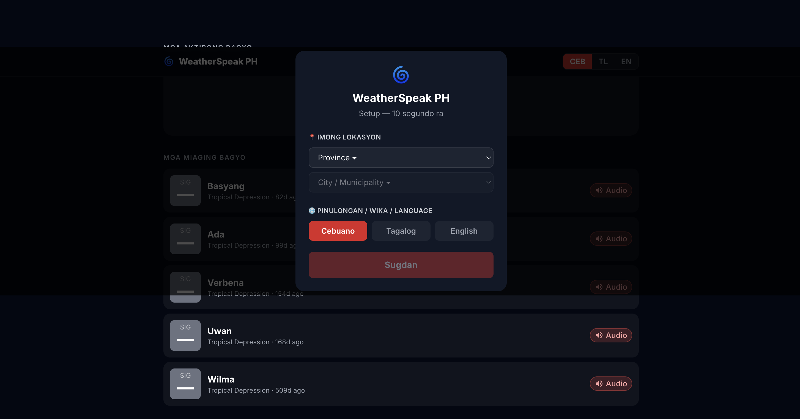
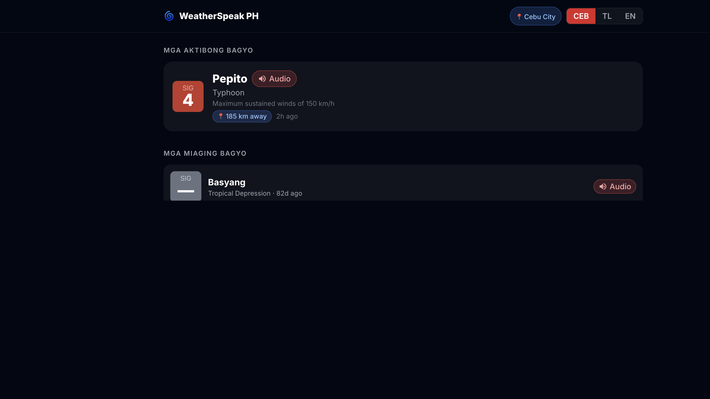
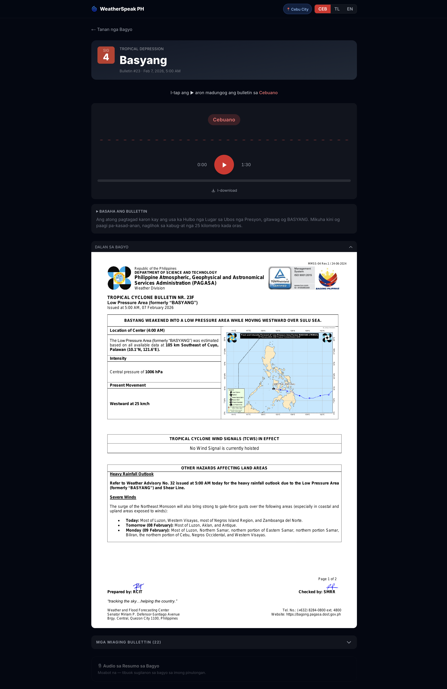

# WeatherSpeak PH — Screenshots for Kaggle Write-up

This folder contains screenshots demonstrating the WeatherSpeak PH application for the Gemma 4 Good Hackathon submission.

---

## Screenshots

### 1. Onboarding Screen
**File:** `01-onboarding.png`

The initial setup modal where users configure their preferences:
- **Province selection:** Choose from 39 Philippine provinces
- **City/Municipality selection:** Dropdown populates based on province
- **Language selection:** Cebuano, Tagalog, or English
- Mobile-first design with clear CTAs
- Takes ~10 seconds to complete

**UX Features:**
- Centered modal overlay on dark background
- Sequential flow: location → language → submit
- Disabled state management (city selector + submit button)
- Multilingual UI labels

---

### 2. Main Page with Active Storm
**File:** `02-main-page-with-active-storm.png`

Homepage showing an active typhoon alert:

**Active Storm Card:**
- **Storm Name:** Pepito (Typhoon)
- **Signal Level:** #4 (red danger badge)
- **Wind Speed:** 150 km/h maximum sustained winds
- **Distance:** 185 km away from user's location (Cebu City)
- **Last Update:** 2 hours ago
- **Audio Badge:** Red pill indicator showing audio available

**Page Elements:**
- Header with location pill (📍 Cebu City) and language toggle (CEB/TL/EN)
- Active Typhoons section with prominent storm card
- Past Storms section below (collapsed)
- Signal badge uses color-coded system:
  - Signal 1: Blue
  - Signal 2: Yellow
  - Signal 3: Orange
  - Signal 4-5: Red

**Interactive Features:**
- Hover effects on storm cards (brightness + scale)
- Audio availability indicators on all storms
- One-click navigation to detailed bulletin

---

### 3. Storm Detail Page with Audio Player
**File:** `03-storm-detail-with-audio-player.png`

Detailed view for "Basyang" (Tropical Depression):

**Hero Section:**
- **Signal Badge:** Gray "SIG —" square (no signal level for tropical depression)
- **Storm Name:** Basyang (large, bold headline)
- **Category:** Tropical Depression
- **Bulletin Info:** #23 · Feb 7, 2026, 5:00 AM
- **Back navigation:** "← Tanan nga Bagyo" (← All Storms)

**Audio Player:**
- **CTA:** "I-tap ang ▶ aron madungog ang bulletin sa Cebuano" (Tap ▶ to hear this bulletin in Cebuano)
- **Language Pill:** "Cebuano" displayed prominently
- **Play Button:** 64×64px centered red circle with SVG play icon
- **Waveform Visualization:** Live frequency bars (idle state shown)
- **Time Display:** Current time (0:00) and duration (1:30) flanking play button
- **Download Link:** Secondary ghost-style link below player
- **Script Preview:** Collapsible details showing bulletin text

**Additional Sections (below fold):**
- Storm track chart with map visualization
- Past bulletins accordion (collapsed, shows count)
- Storm summary audio teaser

---

## Design Principles

### Emergency Response Focus
1. **Signal levels front and center** — color-coded danger indicators
2. **Audio-first** — large play button, impossible to miss
3. **Multilingual** — Cebuano, Tagalog, English support
4. **Mobile-optimized** — large tap targets, vertical layout
5. **Progressive disclosure** — collapsed sections keep focus on critical info

### Accessibility
- High contrast (dark theme with bright accents)
- SVG icons (consistent across platforms)
- Clear visual hierarchy
- Touch-friendly sizing (buttons ≥44px)

### Filipino Context
- Province/city geography data
- 3 languages covering ~90% of PH population
- Distance calculations from user's location
- Time zones (Manila/PH timezone)

---

## Technical Stack

- **Frontend:** Next.js 14, React, TypeScript
- **Styling:** Tailwind CSS
- **Audio:** Web Audio API (AnalyserNode for waveform)
- **TTS:** Coqui XTTS v2 (Cebuano/Tagalog use Spanish phonemes)
- **OCR + Translation:** Gemma 4 E4B via Ollama
- **Storage:** Supabase Storage + PostgreSQL
- **Deployment:** Vercel (PWA)

---

## Hackathon Tracks

- ✅ **Impact (Digital Equity)** — Translates English-only bulletins to Cebuano & Tagalog
- ✅ **Impact (Global Resilience)** — Severe weather communications for vulnerable communities
- ✅ **Ollama Special Track** — Uses Ollama for local Gemma 4 inference
- ✅ **Main Track** — Production-ready emergency response app

---

_Generated: April 30, 2026_
