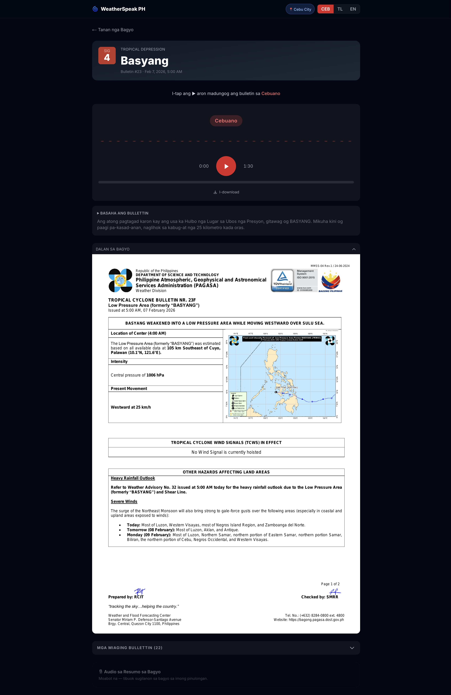

# WeatherSpeak PH: Bridging the Language Gap in Philippine Typhoon Warnings
### Empowering PH communities with Gemma 4: Transforming complex typhoon alerts into actionable text and audio reports in local dialects.

---

## The Technology Isn't the Gap

Picture San Remigio, on the northern coast of Cebu. Typhoon Verbena is on a direct track toward the island. The wind is already bending the coconut palms sideways, and somewhere in Manila, PAGASA has issued a Tropical Cyclone Bulletin, the official word on where the storm is going, how strong it is, and who needs to evacuate.

The bulletin exists. It's public. But it's written in English.

That's a problem. The Philippine Statistics Authority puts functional literacy at 91.6%. In a country of 115 million people, that still leaves nearly 10 million Filipinos who can't reliably make sense of a written document. And English is a language most Filipinos encounter in school, not in daily life. A typhoon bulletin is a formal, technical document. For most people on that coast, it might as well be in another language. Because it is.

I'm Cebuano. I know this problem personally, not as a statistic but as something playing out right now in that town. The people in San Remigio aren't disconnected. They have phones. There's a TV in the sari-sari store. The technology isn't the gap. The language is.

That's the gap **WeatherSpeak PH** tries to close. It takes any PAGASA bulletin, runs it through an AI pipeline, and produces both readable scripts and spoken audio in Cebuano, Tagalog, and English, in under five minutes.

---

## How Can Gemma 4 Possibly Help?

Every PAGASA bulletin follows the same structure: storm position, intensity, wind speed, signal levels, affected areas, storm track. Predictable schema, predictable schedule: exactly the kind of problem a small, fast language model handles well.

Every Gemma 4 model is multimodal. That turns out to be essential here. PAGASA bulletins include a storm track chart that text extraction tools are blind to. Gemma 4 can see it, and with the right prompt, describe it in plain language: "270 km northwest of Pag-asa Island, moving west-northwest at 20 km/h." That image-to-text step is what makes the radio script actually useful.

I started with **Gemma 4 26B**: beautiful translations, but too slow for notebook-driven experimentation. When each inference takes minutes, the iteration loop breaks down. You stop exploring. I dropped to **Gemma 4 E4B** and found the quality gap smaller than expected for structured document work. Fast enough for local Ollama inference and an A10G GPU in production. That tradeoff decided the whole project.

At the center is **Gemma 4 E4B**, handling chart reading, script generation, and all three language translations. Open weights, open source, no proprietary inference APIs.

---

## Nothing Worked the First Time

### Step 1: The Faithful Extraction Problem

My first instinct was to use **Gemma 4 E4B** for everything: feed it the PDF, get structured output back. It hallucinated badly. The problem was faithfulness: it wasn't reproducing the bulletin text as written, it was paraphrasing and sometimes inventing. Back to the notebooks. **Marker PDF** turned out to be near-perfect at faithful text extraction, reproducing the bulletin content exactly as it appeared on the page. But Marker was blind to the storm track chart. **Gemma 4 E4B** could read that chart and describe the storm's position in plain landmark language. Left to its own devices, it outputs coordinates. Nobody in San Remigio knows where 13.9°N, 112°E is. The hybrid was the answer: Marker for text, Gemma 4 for the chart.

### Step 2: Garbage In, Hallucination Out

The goal isn't translation. It's a community radio announcement. The first implementation generated all three languages in parallel directly from the OCR. The problem: they diverged. English came out consistently richer and more faithful to the source. The model simply performs better in English.

The fix: generate English first, then translate Tagalog and Cebuano from that. The local language scripts are now only as wrong as the English one, which is a much smaller problem.

Hallucinations were a separate fight. Gemma 4 E4B was inventing wind speeds: a footnote tag Marker rendered as `75` that the model read as "75 knots," and a stray coordinate row it mistook for the storm's current position.

The fix: strip the noise before the model sees it, tighten the prompt constraints, and strip the markdown signal tables. The same province/signal data appears in plain prose above the tables, so no information is lost, just the nested markdown the 4B model chokes on.

### Step 3: Bible Recordings to the Rescue

**Coqui XTTS v2** supports English natively, and Tagalog and Cebuano through a Spanish phoneme approximation. The problem was quality: when I heard the Tagalog and Cebuano output, it was bad enough to rule out. That led to **Facebook MMS**, trained by Meta on multilingual Bible recordings. It has its own quirks, but the way it speaks Cebuano and Tagalog is noticeably better. The choice was also deliberate: self-hostable, open weights, runs on a GPU I control, no per-character billing, no vendor lock-in. Better commercial options probably exist. I'd rather own the stack.

MMS comes with caveats that had real ETL consequences. It doesn't understand capitalisation or punctuation, so every script needs pre-processing before it reaches the model: lowercase everything, strip punctuation, and phonetically respell any English words that slip through. Building that pre-processing step into the pipeline was non-trivial: forecast → pore-kast, evacuation → i-ba-kyu-we-yon, coastal → kos-tal. Over 30 mappings in total.

Speed tuning was its own problem. The MMS voices speak at different natural rates, so each language needed separate calibration: Cebuano at 1.40×, Tagalog at 1.35×. At 1.5×, Cebuano sounds like a chipmunk.

English stays on **Coqui XTTS v2**, where it handles casing and punctuation natively and sounds noticeably more polished. The contrast in quality between the English and Cebuano/Tagalog audio is real. It's an uncomfortable reminder of why this project exists.

### Step 4: Ollama, Modal, and a Single Command

The pipeline runs on **Modal** with compute matched to each step: OCR and script generation on A10G GPU, three parallel TTS containers for Cebuano, Tagalog, and English, then a CPU container for the Supabase upload.

One architectural decision made everything easier: the pipeline code is fully modular, and the same modules run in both the ETL and the Jupyter notebooks. When I iterate on a prompt in a notebook, the output is identical to what the production ETL produces. There's no "works in the notebook, breaks in production" problem. The notebook and the ETL are running the same code.

**Ollama** runs Gemma 4 E4B in both environments: locally during notebook iteration, and on Modal's A10G in production. Same API, same model weights, different hardware. That's what keeps the notebook and ETL outputs identical.

Modal also removed the need for any orchestration or triggering infrastructure. No scheduler, no cron job, no cloud VM sitting idle. The trigger is a single command from my laptop: `uv run modal run modal_etl/run_batch.py`. Modal provisions the GPU, runs the pipeline, and tears down. All the compute is in the cloud; the trigger is local.

Script generation originally ran all three languages sequentially: one container, one Ollama instance, ~4 minutes wall time. Refactoring to one container per language brought that down to ~1.5 minutes.

When a bulletin came out with the wrong wind speed from a hallucination bug, I didn't want to reprocess the entire archive. So I built two flags: `--stem` to target a single bulletin by name, `--force` to overwrite existing outputs.

---

## A Mobile-First Web Application

The target user is on a cheap Android handset, not at a desk. Every design decision follows from that: 64px play button, audio-first layout, one-tap language toggle between Cebuano, Tagalog, and English.

>The first time I switched the toggle to Cebuano and hit play, and heard a typhoon warning come out in the language my lola speaks, that was the moment the whole project felt real. That's what this is for.

Onboarding collects province, municipality, and language preference. Right now language drives everything: which audio plays, which script is shown, with location wired up for future personalisation. You can download the MP3 for offline playback, which matters where mobile data is intermittent.

---

## Gemma 4: Strengths and Limits

Gemma 4 E4B is reliable when the inputs are clean: predictable schema, clear prompt, no noise. It follows style constraints well: km/h only, landmark-based positions, target word count. It reads a storm chart and describes it in plain language. At E4B speed, it does all of this in seconds.

Where it falls down is noisy context. Stray OCR artefacts, complex nested tables, long prompts that trigger repetition. Any of these can cause the model to hallucinate. The fix is always upstream: clean the input before it reaches the model, and scope what you ask it to do. Don't ask a 4B model to do more than it needs to.

Fine-tuning was a real alternative. A domain-adapted Gemma 4 would likely handle noisy inputs without needing upstream preprocessing. That's outside the scope of this project, but it's the obvious next lever.

---

## What It Can Do Right Now

Any PAGASA bulletin PDF goes in. Cebuano, Tagalog, and English radio scripts and spoken audio come out, end-to-end in around four minutes on Modal.

Getting here took eleven Jupyter notebooks of experimentation across OCR, translation, and TTS before I wrote a single line of production code. Thirty-three pull requests later, the pipeline is running. The storm archive is live, audio is playable from any mobile browser, and every bulletin can be downloaded as an MP3.

---

## What Comes Next

The pipeline works. Now it needs to run without anyone pressing a button. Live PAGASA ingestion is the next step: watching the feed and triggering the ETL automatically when a new bulletin drops. After that, I'll test Gemma 4 26B to see whether a larger model meaningfully improves the translations. And longer term, more languages: Ilocano, Waray, Hiligaynon. The Philippines has over 180 languages. Translation is essentially free once the pipeline exists. Gemma 4 handles new languages with a prompt change. The bottleneck is TTS: low-resource languages have few good options, and that's a problem bigger than one project.

---

## Why It Matters

Typhoon Verbena is still on track toward northern Cebu. The PAGASA bulletin exists. And so does an audio file in Cebuano, generated in four minutes from the same PDF by a batch pipeline running on a cloud GPU, ready to play on the barangay captain's phone.

Digital equity isn't about giving people smartphones. Most of them already have one. It's about making the information on those phones actually useful, in the language they think in, in the voice they trust. Gemma 4 made that real. The code is open source, the model is open weight, and nothing here is specific to the Philippines. Any language, any country, any disaster alert system.

---
