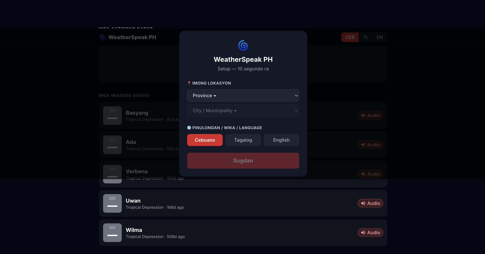
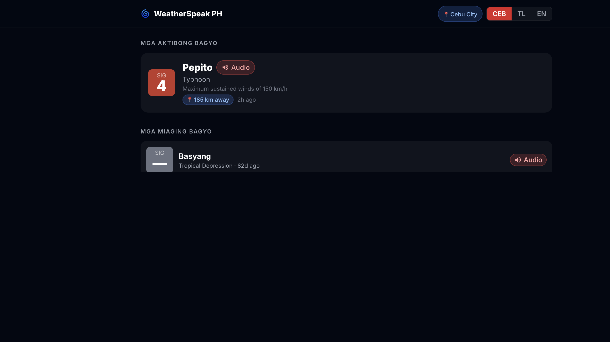

# WeatherSpeak PH: Bridging the Language Gap in Philippine Typhoon Warnings
### Empowering PH communities with Gemma 4: Transforming complex typhoon alerts into actionable text and audio reports in local dialects.

---

## The Technology Isn't the Gap

Picture San Remigio, on the northern coast of Cebu. Typhoon Verbena is on a direct track toward the island. The wind is already bending the coconut palms sideways, and somewhere in Manila, PAGASA has issued a Tropical Cyclone Bulletin, the official word on where the storm is going, how strong it is, and who needs to evacuate.

The bulletin exists. It's public. But it's written in English.

That's a problem. The Philippine Statistics Authority puts functional literacy at 91.6%. In a country of 115 million people, that still leaves nearly 10 million Filipinos who can't reliably make sense of a written document. And English is a language most Filipinos encounter in school, not in daily life. A typhoon bulletin is a formal, technical document. For most people on that coast, it might as well be in another language. Because it is.

I'm Cebuano. I know this problem personally, not as a statistic but as something playing out right now in that town. The people in San Remigio aren't disconnected. They have phones. There's a TV in the sari-sari store. The technology isn't the gap. The language is.

That's the gap **WeatherSpeak PH** tries to close. It takes any PAGASA bulletin, runs it through an AI pipeline, and produces both readable scripts and spoken audio in Cebuano, Tagalog, and English, in under five minutes.

---

## How Can Gemma 4 Possibly Help?

Every PAGASA bulletin follows the same structure: storm position, intensity, wind speed, signal levels, affected areas, storm track. Predictable schema, predictable schedule: exactly the kind of problem a small, fast language model handles well.

Every Gemma 4 model is multimodal. That turns out to be essential here. PAGASA bulletins include a storm track chart that text extraction tools are blind to. Gemma 4 can see it, and with the right prompt, describe it in plain language: "270 km northwest of Pag-asa Island, moving west-northwest at 20 km/h." That image-to-text step is what makes the radio script actually useful.

I started with **Gemma 4 26B**: beautiful translations, but too slow for notebook-driven experimentation. When each inference takes minutes, the iteration loop breaks down — you stop exploring. I dropped to **Gemma 4 E4B** and found the quality gap smaller than expected for structured document work. Fast enough for local Ollama inference and an A10G GPU in production. That tradeoff decided the whole project.

Google Cloud TTS has no Cebuano voice. Solution: **Facebook MMS TTS** for Cebuano and Tagalog, **Coqui XTTS v2** for English, which sounds more natural on its native language.

At the center is **Gemma 4 E4B**, handling chart reading, script generation, and all three language translations. Open weights, open source, no proprietary inference APIs, because a project built for underserved communities shouldn't itself depend on a commercial service that could change its pricing, restrict access, or simply disappear.

---

## 3. The Build — Four Steps, Many Surprises

### Step 1 — Getting Text Out of a PDF

My first attempt was PaddleOCR. It kernel-crashed on macOS the same day I installed it. Next was Surya — good text extraction, completely blind to the storm track chart. I ended up on a hybrid: **Marker PDF** for the text and tables, **Gemma 4 E4B vision** for the chart. Given the image, it describes the storm's position in plain landmark language. Left to its own devices, it outputs coordinates. Nobody in San Remigio knows where 13.9°N, 112°E is.

### Step 2 — From Bulletin to Radio Script

The goal isn't translation — it's a community radio announcement. I generate English first, then translate Tagalog and Cebuano from that. The hallucination problem was real: Gemma 4 E4B was inventing wind speeds. The culprit — a footnote tag Marker rendered as `75` that the model read as "75 knots," plus a stray coordinate row mistaken for the storm's current position. Fix: strip the noise before the LLM sees it, reinforce constraints in the prompt, and strip the complex PAGASA signal tables entirely — the 4B model hallucinates badly on nested markdown.

### Step 3 — Text to Speech for Languages the Industry Left Behind

No commercial TTS exists for Cebuano. **Facebook MMS**, trained on multilingual Bible recordings, is the best available — and it works, with caveats: it doesn't understand capitalisation or punctuation, so input must be fully lowercased, and English words need phonetic respelling. The script generation step handles all of that. English goes through **Coqui XTTS v2**, which handles casing and punctuation natively and sounds noticeably more polished — a gap that quietly illustrates this project's entire premise.

### Step 4 — Getting It Live

The pipeline runs on **Modal** — GPU for OCR and vision, CPU for translation and TTS, then a Supabase upload. When a bulletin had the wrong wind speed from a hallucination bug, I didn't want to reprocess the entire archive — so I built two flags: `--stem` to target a single bulletin, `--force` to overwrite it. I used those flags at 2am more than once.

---

## 4. The Frontend — Mobile-First Because the User Has a Phone, Not a Laptop

The target user is on a cheap Android handset, not at a desk. Every design decision follows from that: 64px play button, audio-first layout, one-tap language toggle between Cebuano, Tagalog, and English.

>The first time I switched the toggle to Cebuano and hit play — and heard a typhoon warning come out in the language my lola speaks — that was the moment the whole project felt real. That's what this is for.

Onboarding collects province, municipality, and language preference. Right now language drives everything — which audio plays, which script is shown — with location wired up for future personalisation. You can download the MP3 for offline playback, which matters where mobile data is intermittent.

---

## 5. What Gemma 4 Gets Right — and Where It Struggles

Gemma 4 E4B is reliable when the inputs are clean: predictable schema, clear prompt, no noise. It follows style constraints well — km/h only, landmark-based positions, target word count. It reads a storm chart and describes it in plain language. At E4B speed, it does all of this in seconds.

Where it falls down is noisy context. Stray OCR artefacts, complex nested tables, long prompts that trigger repetition — any of these can cause the model to hallucinate. The fix is always upstream: clean the input before it reaches the model, and scope what you ask it to do. Don't ask a 4B model to do more than it needs to.

---

## 6. What It Can Do Right Now

Any PAGASA bulletin PDF goes in; Cebuano, Tagalog, and English radio scripts and spoken audio come out — end-to-end in around four minutes on Modal. Both the text and the MP3 are displayed on the mobile app. Getting here took eleven Jupyter notebooks of experimentation — OCR comparisons, model evaluations, TTS trials — before a single line of production code was written. The pipeline has been through 33 pull requests of iteration across OCR, translation, TTS, ETL, and the frontend. The storm archive is live and browsable, audio is playable from any mobile browser, and every bulletin can be downloaded as an MP3.

---

## 7. What Comes Next

The pipeline works. Now it needs to run without anyone pressing a button. Live PAGASA ingestion — watching the feed and triggering the ETL automatically when a new bulletin drops — is the next step. After that, testing Gemma 4 26B to see whether a larger model meaningfully improves the translations. And longer term, more languages: Ilocano, Waray, Hiligaynon. The Philippines has over 180 languages. Translation is essentially free once the pipeline exists — Gemma 4 handles new languages with a prompt change. The bottleneck is TTS: low-resource languages have few good options, and that's a problem bigger than one project.

---

## 8. The Close — Why It Matters

Typhoon Verbena is still on track toward northern Cebu. The PAGASA bulletin exists — and so does an audio file in Cebuano on the barangay captain's phone, generated in four minutes from the same PDF, by a pipeline built by one developer in a few weeks using an open-weight model anyone can run.

Digital equity isn't about giving people smartphones. Most of them already have one. It's about making the information on those phones actually useful — in the language they think in, in the voice they trust. Gemma 4 made that tractable. The code is open source, the model is open weight, and nothing here is specific to the Philippines. Any language, any country, any disaster alert system.

---
